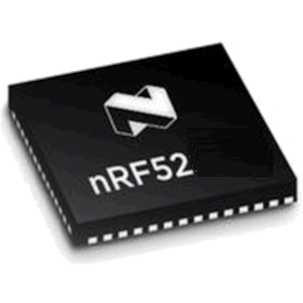
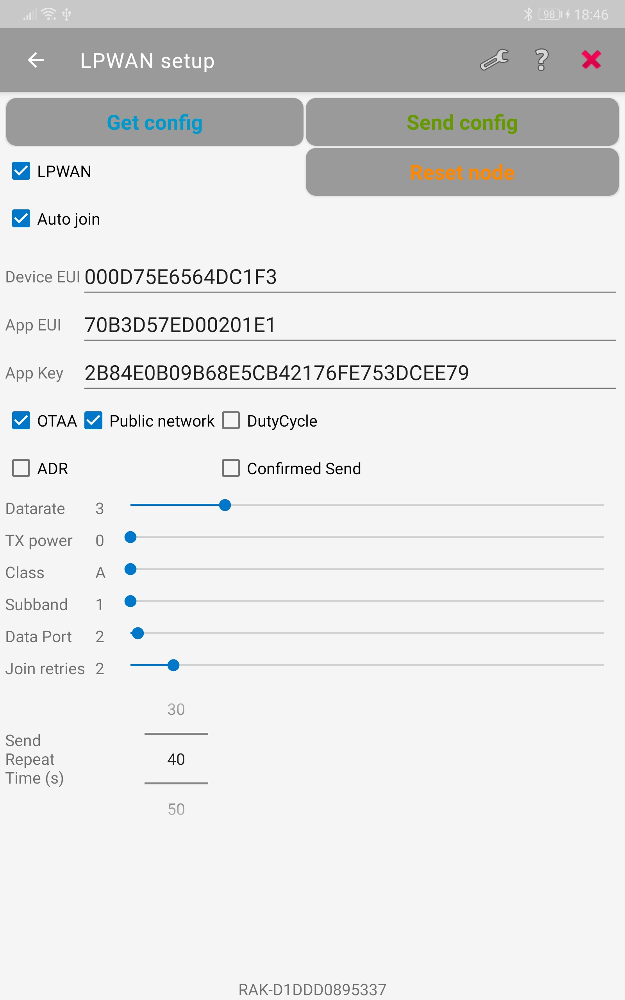
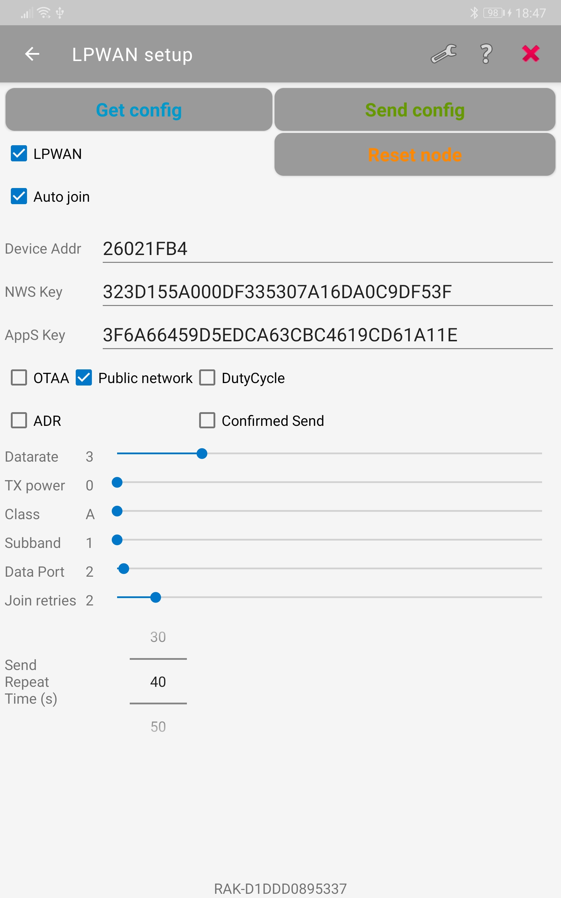
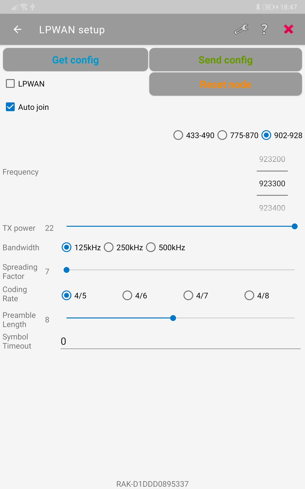

|   |   |   |
| :-: | :-: | :-: |
|  |  |  |

# My-nRF52-Toolbox
Simplified nRF52 toolbox created from [Nordic's nRF52 Toolbox](https://github.com/NordicSemiconductor/Android-nRF-Toolbox)

This application supports right now 4 functions
- Firmware update over BLE with OTA DFU for nRF52 chips
- BLE UART application
- Setup LoRa® and LoRaWAN® parameters of RAK4631 devices over BLE
- Setup ESP32 WiFi credentials over BLE

# WORK IN PROGRESS => NO GUARANTEE THAT IT WORKS ON YOUR PHONE

## OTA DFU
More details in the [NordicSemiconductor/Android-DFU-Libray](https://github.com/NordicSemiconductor/Android-DFU-Library)

## BLE UART
More details to be added

## ESP32 WiFi configuration
More details to be added    
Works only with [RAK11200-WiFi-setup-over-BLE](https://github.com/beegee-tokyo?tab=repositories) example code running on the ESP32

### Screenshots

## LoRa® / LoRaWAN® configuration
- Setup nodes that support LoRa® P2P
- Setup nodes that support LoRaWAN®
- Setup nodes that support both LoRa® P2P and LoRaWAN®
- Build in QR scanner to read device/join EUI from a label on the device
Works only with [RAK4631-LoRa-BLE-Config](https://github.com/beegee-tokyo/RAK4631-LoRa-BLE-Config) examples

### Screenshots

LPWAN OTAA setup    

----
LPWAN ABP setup    

----
P2P setup    

----

Scan QR code    
